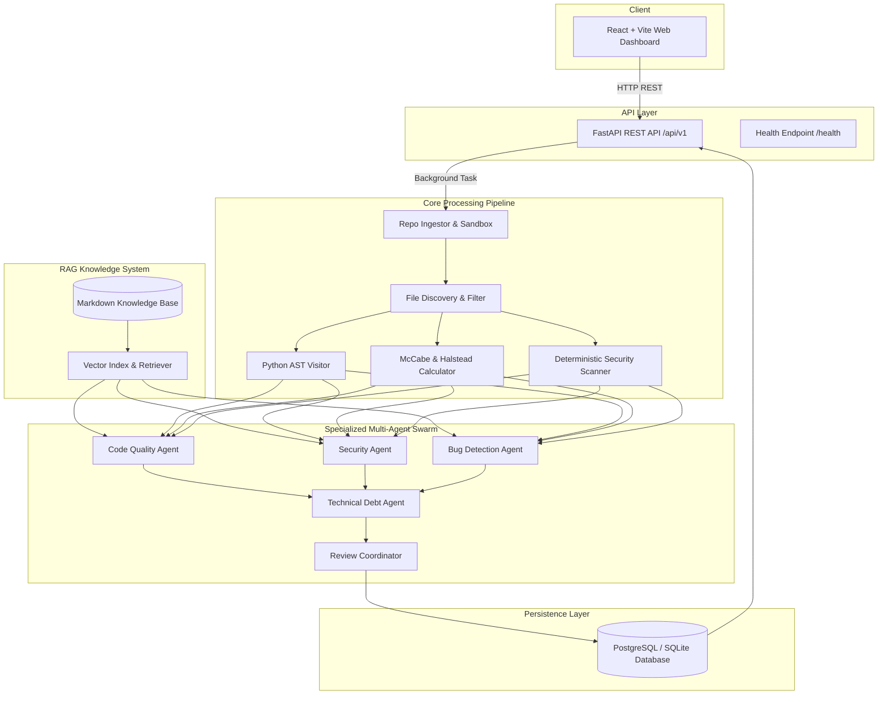

# Technical Architecture: CodeGuard AI

## 1. System Overview
CodeGuard AI is an automated code review and technical debt analyzer designed for Python repositories. It combines deterministic static AST analysis, software engineering complexity metrics, RAG knowledge retrieval, and a specialized multi-agent swarm coordinated by an executive Review Coordinator.

## 2. Multi-Agent Swarm Responsibilities
1. **Code Quality Agent**: Analyzes code smells, function length, parameter counts, naming conventions (PEP 8), and maintainability deficits.
2. **Security Agent**: Evaluates OWASP Top 10 vulnerabilities, command injection (`shell=True`), raw SQL queries, unsafe `eval`/`exec`, insecure deserialization (`pickle`), and hardcoded secrets.
3. **Bug Detection Agent**: Detects potential runtime bugs, mutable default arguments, swallowed exceptions (`except: pass`), resource leaks, and unhandled `None` risks.
4. **Technical Debt Agent**: Calculates the transparent mathematical technical debt score (0-100) and estimated developer remediation hours based on measurable signals.
5. **Review Coordinator**: Merges findings from all agents and deterministic tools, deduplicates overlapping issues, assigns priorities, and generates the executive report.
